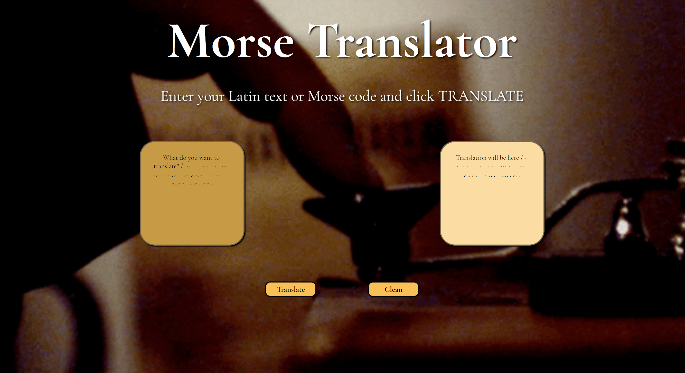

# Morse Translator

## Link to Deployed Version

litvinova08.github.io/morse-translator/

## Description of project (spec / MVP)

This task required me to create a web page Morse Code translator. The focus of this project was putting my code into modules and creating unit tests.

## Reflection

- I

## Future Goals

-

### Stay in touch

- Email: ma.litvinova08@gmail.com
- Portfolio: https://litvinova08.github.io/portfolio-project/
- Linkedin: https://www.linkedin.com/in/margarita-l-44860b15b/

### Licence

- the MIT open source licence

## Author

Margarita Litvinova

## Project Status

In progress
